# VeriLM: Provenance for Open-Weight LLM Inference

When you get a response from an LLM, there is usually no technical way to know what produced it. Not which checkpoint ran. Not whether the decode policy was the one the provider claimed. Not whether the output was modified between generation and delivery. Not whether the provider used the weights they charged for.

VeriLM is a commit-and-audit protocol for open-weight LLM inference. A provider serves a response normally and returns a compact receipt. Later, a verifier can challenge specific token positions and layers, request an opening, and check the opened computation against:

- the committed model identity
- the committed preprocessing policy
- the committed decode and output policy
- the committed transcript state
- the public weights and verifier key

The goal is simple to state and difficult to fake:

> Everything except the attention interior is exact, replayable, and cryptographically bound.

That is a stronger statement than “the outputs looked plausible” or “several replicas agreed.” It is a statement about computation provenance.

## Why provenance matters

Open-weight models are attractive precisely because their weights are public and their behavior can, in principle, be audited. That matters in several settings:

- **Enterprise procurement.** If you are paying for Llama 70B or Qwen 72B, you want proof that the provider really served that checkpoint.
- **Benchmarking and evaluation.** A benchmarker needs to know that the claimed model actually ran.
- **Regulated deployments.** Banks, hospitals, and legal teams often need an auditable chain from decision to model version.
- **Decentralized or untrusted compute.** Networks such as Gensyn, Ritual, or Bittensor cannot rely on “just trust the node.”
- **Agent systems.** If an autonomous system takes action, the question of which model produced the decision becomes a liability and governance question.

VeriLM turns “we ran this model” from a dashboard claim into a cryptographically auditable statement.

## The core trick: verify huge matrix multiplies cheaply

Suppose a provider claims they computed

```
z = W @ x
```

for some public weight matrix `W`. Recomputing `W @ x` directly is expensive.

Freivalds’ algorithm gives a much cheaper check. During setup, the verifier samples a secret random vector `r` and precomputes

```
v = r^T @ W
```

Then, at audit time, the verifier checks

```
v · x  =?  r^T · z
```

with arithmetic in a finite field `F_p` for a prime `p ≥ 2^32`. If `z = W @ x`, the equality always holds. If the provider used the wrong weights or the wrong output, it fails except with probability at most `1/p`.

This is an information-theoretically sound check: if the provider uses the wrong weights or wrong output, the false-accept probability is at most `1/p`. That matters because transformers are mostly matrix multiplication. Once those multiplications become cheap to audit, the verifier can check model identity without rerunning the full model.

In the final VeriLM protocol, Freivalds is used for:

- `W_q`
- `W_k`
- `W_v`
- `W_o`
- `W_gate`
- `W_up`
- `W_down`
- `LM_head`

The verifier still computes the final logits exactly for token replay. Freivalds binds the linear map; exact replay uses the resulting logits.

## What the protocol binds

VeriLM does not only bind “some model ran.” It binds the whole deployment surface that affects outputs.

The final protocol commits four specs:

- `input_spec_hash`
- `model_spec_hash`
- `decode_spec_hash`
- `output_spec_hash`

Together, these bind:

- tokenizer and normalization semantics
- chat template
- BOS/EOS preprocessing policy
- truncation and padding policy
- special-token handling
- system prompt semantics
- model identity `R_W`
- quantization scheme and configuration
- adapter / LoRA / merged-checkpoint identity
- RoPE and scaling configuration
- RMSNorm epsilon
- sampler ID and version
- mode choice, temperature, top-k, top-p
- penalties, logit bias, bad-word masks, grammar constraints, tie-breaking rules
- EOS / ignore-EOS behavior
- stop strings and min/max stopping rules
- detokenization / cleanup / whitespace normalization

If any of those semantics change, the committed receipt changes.

## The guarantee boundary

VeriLM has four guarantee classes:

- **Exact.** Cryptographically checked or canonically recomputed with unambiguous semantics.
- **Approximate.** Replayed and constrained, but not bit-reproducible because native FP16/BF16 attention is hardware-sensitive.
- **Statistical.** Commitment binding is exact, but correctness of unopened positions depends on challenge sampling unless deep audit is used.
- **Fail-closed.** A feature is either replayed exactly or rejected explicitly. The verifier never silently accepts unsupported semantics.

This yields a clean protocol boundary:

- **Exact:** preprocessing binding, embedding binding, shell matmuls, bridge operations, the final-token tail, LM-head binding, canonical sampled replay, and output-policy replay.
- **Approximate:** the attention interior only.
- **Statistical:** prefix/KV provenance in routine audit mode.
- **Exact again in deep audit:** full-prefix checking when the stronger audit mode is used.

```mermaid
flowchart LR
    A["Input preprocessing<br/>Exact<br/><code>input_spec_hash</code>"] --> B["Embedding lookup<br/>Exact<br/>Merkle binding"]
    B --> C["Shell matmuls + bridges<br/>Exact<br/>Freivalds + canonical replay"]
    C --> D["Prefix / KV provenance<br/>Statistical by default<br/>Exact in deep audit"]
    D --> E["Attention interior<br/>Approximate<br/>FP16/BF16 replay corridor"]
    E --> F["Final-token boundary<br/>Exact<br/>captured pre-final-norm residual"]
    F --> G["LM head<br/>Exact<br/>Freivalds + exact logits"]
    G --> H["Decode / output policy<br/>Exact or fail-closed<br/><code>decode_spec_hash</code> + <code>output_spec_hash</code>"]
```



## What a transformer computes, and where the hard part is

Inside one layer, the high-level structure is:

```
RMSNorm
W_q, W_k, W_v
Requantize i32 → i8
RoPE on Q, K
Attention (Q@K^T, softmax, α@V)     ← the only approximate stage
W_o
Residual add
RMSNorm
W_gate, W_up
SiLU(gate) ⊙ up
W_down
Residual add
```

All shell operations are deterministic or canonically recomputable. The one stage that is not exactly reproducible across hardware is FP16/BF16 attention.

The protocol therefore does two things at once:

- it makes the shell exact
- it constrains attention from both sides without pretending it is exact

The final-token tail is also exact, but only because the protocol starts that exact tail from a captured live boundary state: the pre-final-norm residual after the last transformer layer.

## The full protocol in three phases

### Phase 0: Setup

The verifier starts from a public checkpoint and computes a public model identity `R_W`, a Merkle root over the checkpoint in canonical order.

Then the verifier generates a secret verifier key:

- Freivalds vectors for the seven shell matrix families and `LM_head`
- embedding commitment data
- final RMSNorm weights
- model configuration needed for canonical replay

The verifier key is secret. If the prover learns the verifier’s Freivalds vectors, the linear checks can be forged.

### Phase 1: Commitment

The provider runs inference normally. VeriLM adds a tracing layer that captures the retained state needed for later audit.

For every token, the provider commits:

- shell inputs and outputs
- quantization bridge state
- post-attention retained state
- prefix/KV state
- the exact final-token boundary state
- deployment metadata through the four committed specs
- transcript randomness through a per-request `batch_seed` and `seed_commitment`

The provider returns the response plus a compact receipt containing the trace commitments, the manifest commitment, the randomness commitment, and transcript metadata.

### Phase 2: Verification

When challenged, the provider opens the requested token positions and layers.

The verifier then performs:

1. **Embedding binding.** Check that the token really maps to the committed embedding row.
2. **Shell verification.** Run Freivalds on the shell matmuls and canonically recompute bridge operations.
3. **KV provenance.** Open the committed prefix/KV state and sample earlier positions, or use deep audit for exact full-prefix checking.
4. **Attention replay.** Recompute attention independently against the committed prefix and compare to the committed post-attention output.
5. **Final-token replay.** Start from the captured pre-final-norm residual, apply the final RMSNorm exactly, bind `LM_head` with Freivalds, compute logits exactly, replay the canonical decode policy, and verify the chosen token and output-policy behavior.

That last step is what closes the “final-token gap.” The verifier must not derive the token from a hidden state reconstructed through many approximate attention layers and then call the result exact.

## Unsupported features are not “best effort”

The final protocol has a strict rule:

> Every decode or output feature is either replayed exactly or rejected explicitly.

That means:

- no hidden fallback from exact replay to approximate replay
- no silently ignored decode modifiers
- no “the manifest bound it, but the verifier didn’t really use it”

Unsupported features must fail closed.

## What VeriLM proves exactly

The final protocol gives exact guarantees for:

- model identity `R_W`
- embedding lookup
- shell matmuls
- bridge operations
- final-token boundary from the captured pre-final-norm residual onward
- LM-head binding
- exact logits computation
- canonical decode replay
- output-policy replay

This is the heart of the claim “everything except attention.”

## What remains approximate

The attention interior remains approximate because native GPU FP16/BF16 attention is not bit-reproducible across devices or even across runs.

VeriLM still constrains it strongly:

- shell-verified `Q`, `K`, and `V`
- commitment-verified prefix state
- independent verifier replay
- cross-layer consistency through the residual stream

But it does not pretend that FP16/BF16 attention is exact.

## What remains statistical

In routine audit mode, prefix/KV provenance is statistical:

- Merkle binding is exact
- sampled earlier positions are shell-verified exactly
- unopened prefix positions are covered probabilistically

Deep audit is the stronger path that upgrades prefix checking to exact full-prefix verification.

## What providers still pay

VeriLM is a sidecar protocol, not a zk proof system. The serving path still runs ordinary inference. The provider pays for:

- tracing retained state
- storing audit-window state
- returning a compact receipt on every response
- responding to the relatively small fraction of responses that get audited

The final protocol is designed so that the expensive work is rare and challenge-driven, not paid on every response.

## Why not ZK?

The obvious alternative is a zero-knowledge proof of inference.

That gives a different tradeoff:

- full third-party verifiability
- much larger prover overhead
- less natural fit for public open weights

VeriLM chooses a different point in the design space:

- interactive audit
- client-held verifier key
- very small normal-path overhead
- strong model-provenance guarantees

It is deliberately not a transferable proof system.

## Supported architectures

The final protocol targets autoregressive decoder-only transformers with the committed capture layout and replay semantics. Unsupported architectures must fail closed rather than be silently interpreted as if they were Llama-style decoder stacks.

## Assumptions outside protocol scope

VeriLM does not assume honest prover hardware or honest provider runtime behavior. Those are what the protocol is meant to eliminate.

The explicit assumptions outside protocol scope are:

- standard cryptographic assumptions for the hash functions
- information-theoretic soundness of the finite-field Freivalds checks
- secrecy of verifier-only material such as the Freivalds vectors
- no side-channel leakage of verifier-secret material
- correct execution of the verifier itself

Those assumptions should be stated explicitly, not hidden inside vague language about “trust.”

## The real remaining research question

The main open question is still the attention corridor:

- how tightly FP64 verifier replay tracks production FP16/BF16 attention after requantization
- how to calibrate tolerances so the verifier is honest about what is exact and what is only approximately constrained

That is the genuine “except attention” boundary. Everything else in the final protocol is meant to be bound, checked, replayed exactly, or rejected.

The code is at [github.com/lambdaclass/verishell](https://github.com/lambdaclass/verishell). The implementation roadmap for reaching this final protocol is in the repository’s `roadmap.md`.
